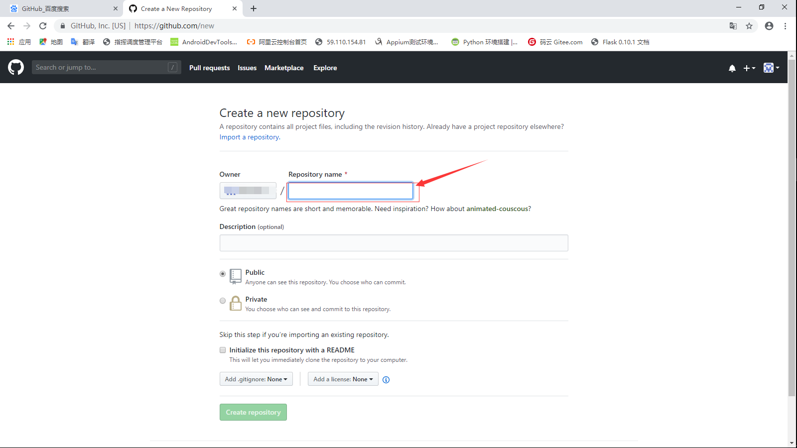
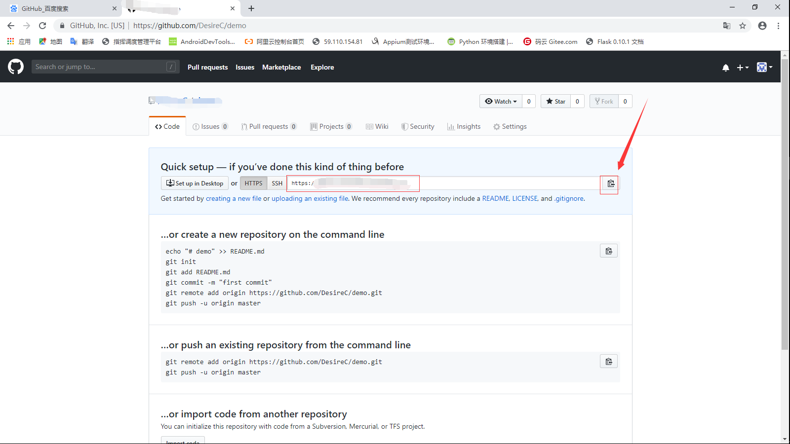

[](../首页.md#index)

<h1 id="github">Git命令上传本地代码到GitHub</h1>

上传的步骤：

　　　　本文采用git 命令界面进行操作,先执行以下两个命令，配置用户名和email【设置用戶名和e-mail地址。这是非常重要的，因為每次Git提交都会使用该信息。它被永遠的嵌入到了你的提交中】

​           git config --global user.email "you@example.com"
​           git config --global user.name "Your Name"

 然后开始创建项目并提交至远程git仓库，步骤如下：

1.进入本地的项目目录，右键“Git Bash here”,调出git命令行界面，然后输入

```
git init
```

2.将目录下的所有文件上传，也可以将“.”换成具体的文件名

```
git add .     
```

3.将项目提交到本地仓库

```
git commit -m "注释语句"  
```

4.在github上创建新的repository



5.点击 “Create repository”跳转到一个连接，如下红色圈获取到本项目的github地址



6.将本地的代码关联到github上

```
git remote add origin 项目的github地址
```

7.上传代码到github之前需要先pull  

```
git pull origin master 
```

8.上传代码到远程git仓库

```
git push -u origin master
```

 9.输入自己github的账号，密码，代码会成功上传上去

------

- [ ] 以下是可能出现的错误 

如果输入入$ git remote add origin [git@github.com:djqiang（github账户名）/gitdemo（项目名）.git]() 

​    提示出错信息：fatal: remote origin already exists.

   解决办法如下：

​    1、先输入$ git remote rm origin

​    2、再输入$ git remote add origin [git@github.com:djqiang/gitdemo.git](mailto:git@github.com:djqiang/gitdemo.git) 就不会报错了！

​    3、如果输入$ git remote rm origin 还是报错的话，error: Could not remove config section 'remote.origin'. 我们需要修改gitconfig文件的內容

​    4、找到你的github的安装路径，我的是C:\Users\ASUS\AppData\Local\GitHub\PortableGit_ca477551eeb4aea0e4ae9fcd3358bd96720bb5c8\etc

​    5、找到一个名为gitconfig的文件，打开他把里面的`[remote "origin"]那一行`刪掉就好了！

 

​    如果输入$ ssh -T [git@github.com](mailto:git@github.com)
​    出现错误提示：Permission denied (publickey).因为新生成的key不能加入ssh就会导致连接不上github。

  解决办法如下：

​    1、先输入$ ssh-agent，再输入$ ssh-add ~/.ssh/id_key，这样就可以了。

​    2、如果还是不行的话，输入ssh-add ~/.ssh/id_key 命令后出现保错Could not open a connection to your authentication agent.解决方法是key用Git
​        Gui的ssh工具生成，这样生成的时候key就直接保存在ssh中了，不需要再ssh-add命令加入了，其它的user，token等配置都用命令行来做。

​    3、最好检查一下在你复制id_rsa.pub文件的內容时有没有产生多余的空格或空行，有些编辑器会帮你添加这些的。

 

​    如果输入$ git push origin master

​    提示出错信息：error:failed to push som refs to .......

​    解决办法如下：

​    1、先输入$ git pull origin master //先把远程伺服器github上面的文件拉下来

​    2、再输入$ git push origin master

​    3、如果出现报错 fatal: Couldn't find remote ref master或者fatal: 'origin' does not appear to be a git repository以及fatal:
​          Could not read from remote repository.

​    4、则需要重新输入$ git remote add origin[git@github.com:djqiang/gitdemo.git]()