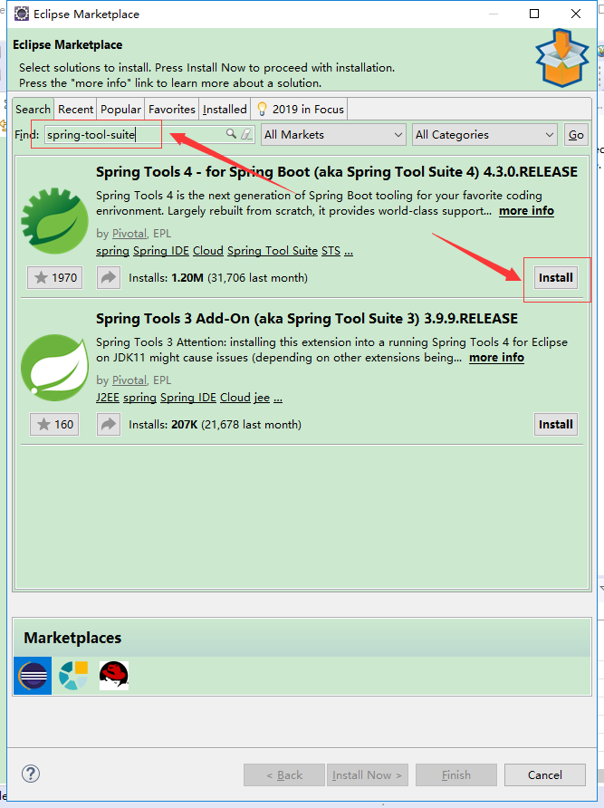

<h1 id="EB">Eclipse添加spring-tool-suite插件</h1>

<h4>步骤</h4>

1、help --> Eclipse Marketplace，在search框中搜索**spring-tool-suite**，点击右下角的**install**按钮进行安装

2、继续**confirm**，继续安装

3、Review license，点击**accept**后，点击**Finish**继续安装

4、安装需要几分钟，安装完成，会有一个提示重启eclipse的按钮，点击**Restart Now**进行重启

5、重启后，便可以看到springboot相关的工程项目录了，至此，eclipse的spring boot插件安装完成。

