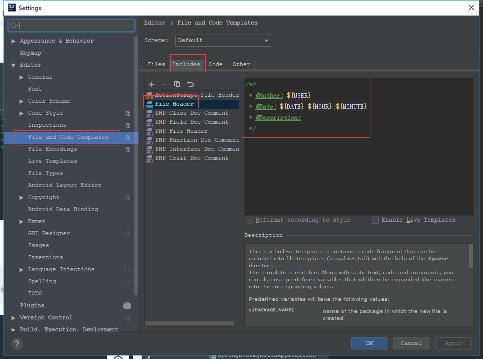
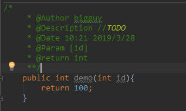
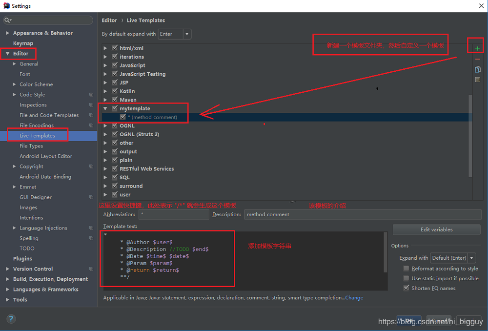
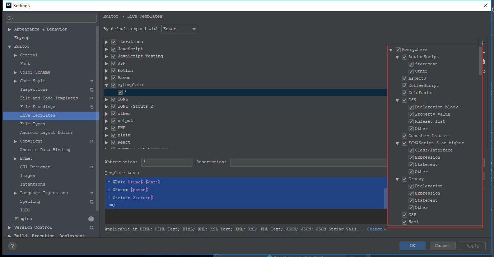
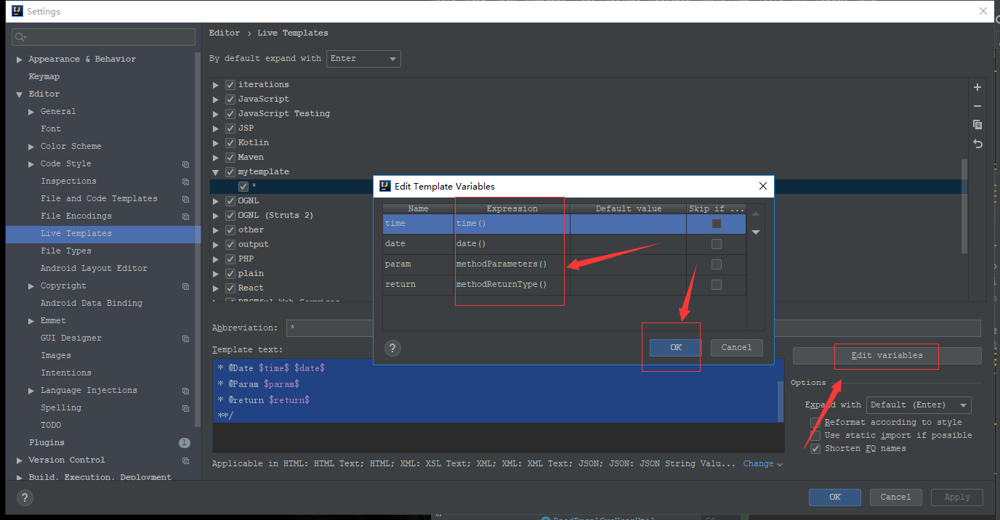

[](../../index.md#index)

<h1 id="idea">IDEA 中修改默认的注解模板</h1>

<h3>1、修改类上的注释</h3>

***效果图***


***修改方式***



***格式***

```java
${USER} 会动态取到电脑的用户名
如果想手动设置用户名，可以将"${USER}" 替换成任意的（静态）名字

/**
 * @Auther: ${USER}
 * @Date: ${DATE} ${HOUR}:${MINUTE}
 * @Description: 
 */
```

<h3>修改方法的注释模板</h3>

***效果图***



***修改方式***



***模板代码***

```java
*
 * @Author Desire
 * @Description //TODO 
 * @Date $time$ $date$
 * @Param $param$
 * @return $return$
 **/
```

***设置完后还需要为设置的参数设置函数，以获取对应的信息***



