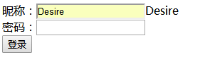

[](../../index.md#index)

<h1 id="smjson">SpringMVC返回JSON数据</h1>

1、导jar包

```xml
<dependency>
	<groupId>com.alibaba</groupId>
	<artifactId>fastjson</artifactId>
	<version>1.2.54</version>
</dependency>
```

2、在springmvc.xml中添加

```xml
<!-- 用于解决@ResponseBody返回的数据中文乱码 -->
	<bean class="org.springframework.web.servlet.mvc.method.annotation.RequestMappingHandlerAdapter">
		<property name="messageConverters">
			<list>
				<bean class="org.springframework.http.converter.StringHttpMessageConverter">
					<property name="supportedMediaTypes">
						<list>
							<value>text/html;charset=utf-8</value>
						</list>
					</property>
				</bean>
			</list>
		</property>
	</bean>
```

3、导入jquery-1.9.1.js

4、编写json.jsp

```jsp
<html>
<head>
<meta charset="UTF-8">
<title>JSON返回</title>
<!-- 引入 jquery 脚本 -->
<script type="text/javascript" src="../js/javascript/jquery-1.9.1.js"></script>
<script type="text/javascript">
	$(function() {
		$("#name").blur(function() {
			$.ajax({
				url:"json",
				data:{"name":$("#name").val()},
				success:function(rs){
					document.getElementById("spanName").innerHTML = rs;
				},
				dataType:"text"
			});
		});
	})
</script>
</head>
<body>
	<form action="" method="post">
		昵称：<input type="text" name="name" id="name"><span id="spanName"></span><br>
		密码：<input type="password" name="password" id="psw"><span id="spanPsw"></span><br>
		<input type="submit" value="登录">
	</form>
</body>
</html>
```

5、处理Ajax请求controller，JSONController.java

```java
@Controller
@RequestMapping("/common")
public class JSONController {
	@RequestMapping(value="/jsonPage",method= {RequestMethod.GET})
	public String getPage() {
		return "json";
	}
	@RequestMapping(value="/json",method= {RequestMethod.GET})
	@ResponseBody
	public String jsons(HttpServletRequest request) {
		String name = request.getParameter("name");
		if (name.length()>0) {
			return name;
		}else {
			return "用户名不能为空！";
		}
	}
}
```

**Jquery请求controller返回JSON字符串中文乱码处理**

```java
@RequestMapping(value="/list/{id}",
method={RequestMethod.POST},
produces={"text/html;charset=UTF-8;","application/json;"})
```

**6、** **运行**

​	<http://localhost:8888/SpringMVC2/common/jsonPage>



