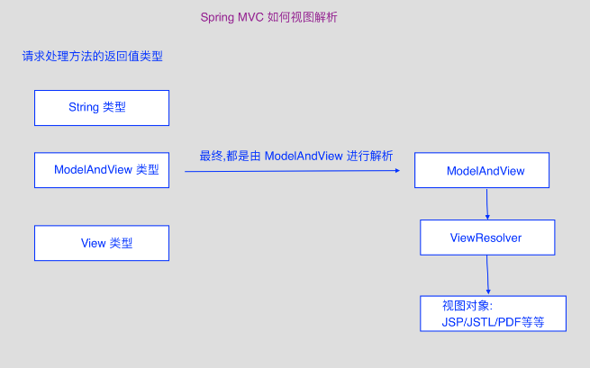

[](../../index.md#index)

<h1 id="restful">SpringMVC 之 RESTful 风格的增删改查</h1>

## **1.视图和视图解析器**

**1.** **1.视图解析器**

请求处理方法执行完成后,最终返回一个ModelAndView对象,对于返回String,View 或 ModelMap等类型的处理方法, SpringMVC 也会在内部将它们装配成一个ModelAndView对象;

SpringMVC借助视图解析器(ViewResolver)得到最终的视图对象(View),最终的视图可以是 JSP,EXCEL,PDF等各种表现形式的视图;

**1.2.视图**

视图的作用是渲染模型数据,将模型里的数据以某种形式呈现给客户;

View 接口,位于 **org.springframework.web.servlet**包中;

视图对象由视图解析器负责实例化.由于视图是无状态的,所以它们不会有线程安全的问题;



**2.mvc:view-controller标签**

作用: 在不需要Controller处理request请求的情况下,直接将设置的View交给相应的视图解析器解析为视图;

```xml
// 在 springDispatcherServlet-servlet.xml 中配置 
<mvc:view-controller path="/自定义网址" view-name="View视图页面名称"/> 
// 还需要使用 mvc:annotation-driven 标签,
//否则,在使用 Controller 处理request请求时,访问该页面,会报异常; 
<mvc:annotation-driven></mvc:annotation-driven>
```

**3. 自定义视图**

·建立专门的view包: cn.itcast.springmvc.views;

·编写一个View接口的实现类;

将BeanNameViewResolver配置进springmvc配置文件;

```java
// 1. 创建View接口的实现类
@Component
public class HelloView implements View{
    public String getContentType(){
        return "text/html;charset=UTF-8";
    }
    public void render(Map<String,?> model, HttpServletRequest request,
                                HttpServletResponse response) throws Exception{
        response.setContentType("text/html;charset=utf-8");
        response.getWriter().write("自定义视图显示");
        response.getWriter().flush();
        response.getWriter().close();                            
        }
}
```

```xml
// 2. springDispatcherServlet-servlet.xml 中配置视图解析器
<bean id="BeanNameViewResolver"         class="org.springframework.web.servlet.view.BeanNameViewResolver">
    <!-- 自定义order,越小越靠前 -->
    <property name="order" value="30"></property>
</bean>
```

```java
// 3. demo.java
@Controller
public class HelloWorld{
    @RequestMapping(value="/helloworld",method=RequestMethod.GET)
    public String helloworld(){
        System.out.println("执行成功");
        return "helloView";
    }
}
```

**4.请求转发和重定向**

地址栏是否变化,参数能否取得,发送了几次请求;

请求转发:一个请求一个响应;

重定向:两个请求两个响应,两个请求之间毫无关系,所以第一个请求里面保存的信息在第二个请求里面无法获得;

```java
// demo.java 
@Controller 
Public class Helloworld{
     // 重定向 
    @RequestMapping(value="/redirect",method=RequestMethod.GET) 
    public String helloworld(){ 
        System.out.println("程序运行正常");
        return "redirect:/1.jsp";
     } 
    // 转发 
    @RequestMapping(value="/forward",method=RequestMethod.GET) 
    public String helloworld(){
    	System.out.println("程序运行正常"); 
    	return "forward:/2.jsp"; 
    } 
}
```

## **5. RESTful SpringMVC CRUD**

**5.1 REST(Representational State Transfer) 架构的主要原则**

- 网络上的所有事物都可被抽象为资源(Resource);
-  每个资源都有一个唯一的资源标识符(Resource Identifier);
-  同一资源具有多种表现形式(xml,json等);
-  对资源的各种操作不会改变资源标识符;
-  所有的操作都是无状态的(Stateless);
-  符合REST原则的架构方式,即可称为RESTful;

**5.2** **RESTful是什么，为什么用，怎么用**

**①RESTful是什么**

REST：是一组架构约束条件和原则

REST（Representational State Transfer）：表现层状态转移，一种软件架构风格，不是标准。既然不是标准，我可以遵守，也可以不遵守！！！ 

什么是表现层状态转移：

​		Representational （表现层） 

​		State Transfer（状态转移）：通过HTTP动词实现。

总结：URL定位资源，HTTP动词（GET，POST，PUT，DELETE）描述操作。

其实RESTful绝大部分内容都是关于API设计时规范推荐的做法，并没有新东西。只要符合REST设计原则的API都可以被称为RESTful。

RESTful的核心就是后端将资源发布为URI，前端通过URI访问资源，并通过HTTP动词表示要对资源进行的操作。这里涉及到一个新概念：资源，后端提供的所有内容都可以被定义为资源。典型的RESTful如下：

GET       /student     //查找所有学生

GET       /student/1  //查找id为1的学生

POST     /student     //新增一个学生

PUT     /student/1     //修改id为1的学生

DELETE  /student/1  //删除id为1的学生

**②为什么用RESTful**

前后端分离主要是以API为界限进行解耦的，这就会产生大量的API，采用RESTful来设计API主要有以下好处：

1、表现力更强，更易于理解

2、RESRful是无状态，所以不管前端是何种设备何种状态都可以无差别的请求资源

**③怎么用RESTful**

1、每个资源使用2个URL，网址中只能有名词

2、对于资源的操作类型由HTTP动词来表示

3、统一的返回结果

4、返回正确的状态码

5、允许通过HTTP内容协商，建议格式预定义为JSON

6、对可选发杂的参数，使用查询字符串（？）

7、返回有用的错误信息(message)

8、非资源请求用动词，这看起似乎和1中的说法有矛盾，但这里指的是非资源，而不是资源

**如何设计Restful风格的API**

**1.路径设计**

 —>在RESTful架构中，每个网址代表一种资源（resource），所以网址中不能有动词，只能有名词，而且所用的名词往往与数据库的表名对应，一般来说，数据库中的表都是同种记录的”集合”（collection），所以API中的名词也应该使用复数。 

 —>举例来说，有一个API提供动物园（zoo）的信息，还包括各种动物和雇员的信息，则它的路径应该设计成下面这样。

   https://api.example.com/v1/zoos 

   https://api.example.com/v1/animals 

   https://api.example.com/v1/employees

**2.HTTP动词设计**

对于资源的具体操作类型，由HTTP动词表示，常用的HTTP动词如下：

| **请求方式** | **含义**                               |
| ------------ | -------------------------------------- |
| GET          | 获取资源（一项或多项）                 |
| POST         | 新建资源                               |
| PUT          | 更新资源（客户端提供改变后的完整资源） |
| DELETE       | 删除资源                               |

如何通过路径和http动词获悉要调用的功能：

| **请求方式**               | **含义**                                           |
| -------------------------- | -------------------------------------------------- |
| GET /zoos                  | 列出所有动物园                                     |
| POST /zoos                 | 新建一个动物园                                     |
| GET /zoos/ID               | 获取某个指定动物园的信息                           |
| PUT /zoos/ID               | 更新某个指定动物园的信息（提供该动物园的全部信息） |
| DELETE /zoos/ID            | 删除某个动物园                                     |
| GET /zoos/ID/animals       | 列出某个指定动物园的所有动物                       |
| DELETE /zoos/ID/animals/ID | 删除某个指定动物园的指定动物                       |

**5.3.使用RESTful**

**在web.xml中添加：**

```xml
<!-- 将POST请求转化为DELETE或者是PUT 要用_method指定真正的请求参数 --> 
<filter>
		<filter-name>HiddenHttpMethodFilter</filter-name>
		<filter-class>org.springframework.web.filter.HiddenHttpMethodFilter</filter-class>
</filter>
<filter-mapping>
		<filter-name>HiddenHttpMethodFilter</filter-name>
		<url-pattern>/*</url-pattern>
</filter-mapping>
```

