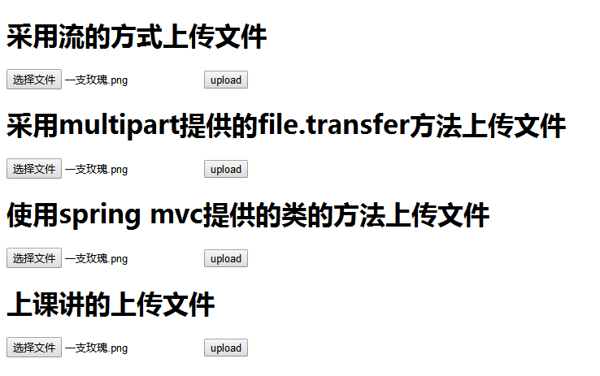

[](../../index.md#index)

<h1 id="smFile">SpringMVC文件上传(四种方法)</h1>

### **1.** **添加文件上传需要的jar**

```xml
<dependency>
	<groupId>commons-fileupload</groupId>
	<artifactId>commons-fileupload</artifactId>
	<version>1.3.2</version>
</dependency>
```

### **2.在springmvc.xml中添加支持上传文件的bean**

```java
<!-- 支持上传文件 -->
<bean id="multipartResolver"	class="org.springframework.web.multipart.commons.CommonsMultipartResolver">
    <!-- 设置上传文件的最大尺寸为1MB -->
    <property name="maxUploadSize">
    	<value>1048576</value>
    </property>
    <property name="defaultEncoding">
    	<value>UTF-8</value>
    </property>
</bean>
```

### **3.编写前端页面：fileUpdata.jsp**

```java
	<form name="serForm" action="fileUpload" method="post"
		enctype="multipart/form-data">
		<h1>采用流的方式上传文件</h1>
		<input type="file" name="file"> <input type="submit"
			value="upload" />
	</form>

	<form name="Form2" action="fileUpload2" method="post"
		enctype="multipart/form-data">
		<h1>采用multipart提供的file.transfer方法上传文件</h1>
		<input type="file" name="file"> <input type="submit"
			value="upload" />
	</form>

	<form name="Form2" action="springUpload" method="post"
		enctype="multipart/form-data">
		<h1>使用spring mvc提供的类的方法上传文件</h1>
		<input type="file" name="file"> <input type="submit"
			value="upload" />
	</form>
	
	<form action="upload" method="post"
		enctype="multipart/form-data">
		<h1>上课讲的上传文件</h1>
		<input type="file" name="file"> 
		<input type="submit" value="upload" />
	</form>
```

### **4.创建FileUpdataController.java类**

```java
@Controller
@RequestMapping(value = "/common")
public class FileUpdataController {

	@RequestMapping(value = "/fileUpdata", method = { RequestMethod.GET })
	public String getPage() {
		return "fileUpdata";
	}

	/**
	 *  方法一 
	 *  通过流的方式上传文件
	 * @RequestParam("file") 将name=file控件得到的文件封装成CommonsMultipartFile 对象
	 * @param request
	 * @param file
	 * @return
	 * @throws IOException
	 */
	@RequestMapping("fileUpload")
	public String fileUpload(HttpServletRequest request,@RequestParam("file") CommonsMultipartFile file) throws IOException {

		// 用来检测程序运行时间
		long startTime = System.currentTimeMillis();
		System.out.println("fileName：" + file.getOriginalFilename());
		String path = request.getSession().getServletContext().getRealPath("fileUpload");
//		String path = "E:/springUpload"+file.getOriginalFilename();
		try {
			// 获取输出流
			//OutputStream os = new FileOutputStream(path);
			File myFile = new File(path,file.getOriginalFilename());
			//如果不存在路径会自动生成
			if (!myFile.exists()) {
				myFile.mkdirs();
			}
			OutputStream os = new FileOutputStream(myFile);
			// 获取输入流 CommonsMultipartFile 中可以直接得到文件的流
			InputStream is = file.getInputStream();
			int temp;
			// 一个一个字节的读取并写入
			while ((temp = is.read()) != (-1)) {
				os.write(temp);
			}
			os.flush();
			os.close();
			is.close();

		} catch (FileNotFoundException e) {
			// TODO Auto-generated catch block
			e.printStackTrace();
		}
		long endTime = System.currentTimeMillis();
		System.out.println("方法一的运行时间：" + String.valueOf(endTime - startTime) + "ms");
		return "/success";
	}

	/**
	 * 方法二
	 * 采用file.Transto 来保存上传的文件
	 * @param request
	 * @param file
	 * @return
	 * @throws IOException
	 */
	@RequestMapping("fileUpload2")
	public String fileUpload2(HttpServletRequest request,
			@RequestParam("file") CommonsMultipartFile file) throws IOException {
		long startTime = System.currentTimeMillis();
		System.out.println("fileName：" + file.getOriginalFilename());
		String path = request.getSession().getServletContext().getRealPath("fileUpload");
//		String path = "E:/springUpload"+file.getOriginalFilename();
		File myFile = new File(path,file.getOriginalFilename());
		//如果不存在路径会自动生成
		if (!myFile.exists()) {
			myFile.mkdirs();
		}
		// 通过CommonsMultipartFile的方法直接写文件（注意这个时候）
		file.transferTo(myFile);
		long endTime = System.currentTimeMillis();
		System.out.println("方法二的运行时间：" + String.valueOf(endTime - startTime) + "ms");
		return "/success";
	}

	/**
	 *  方法三 
	 *  采用spring提供的上传文件的方法
	 * @param request
	 * @return
	 * @throws IllegalStateException
	 * @throws IOException
	 */
	@RequestMapping("springUpload")
	public String springUpload(HttpServletRequest request) throws IllegalStateException, IOException {
		long startTime = System.currentTimeMillis();
		// 将当前上下文初始化给 CommonsMutipartResolver （多部分解析器）
		CommonsMultipartResolver multipartResolver = new CommonsMultipartResolver(
				request.getSession().getServletContext());
		// 检查form中是否有enctype="multipart/form-data"
		if (multipartResolver.isMultipart(request)) {
			// 将request变成多部分request
			MultipartHttpServletRequest multiRequest = (MultipartHttpServletRequest) request;
			// 获取multiRequest 中所有的文件名
			Iterator iter = multiRequest.getFileNames();

			while (iter.hasNext()) {
				// 一次遍历所有文件
				MultipartFile file = multiRequest.getFile(iter.next().toString());
				if (file != null) {
					String path = request.getSession().getServletContext().getRealPath("fileUpload");
//					String path = "E:/springUpload"+file.getOriginalFilename();
					File myFile = new File(path,file.getOriginalFilename());
					//如果不存在路径会自动生成
					if (!myFile.exists()) {
						myFile.mkdirs();
					}
					// 上传
					file.transferTo(myFile);
				}

			}

		}
		long endTime = System.currentTimeMillis();
		System.out.println("方法三的运行时间：" + String.valueOf(endTime - startTime) + "ms");
		return "/success";
	}
	/**
	 * 方法四：上课讲的
	 * @param request
	 * @param file
	 * @return
	 * @throws IllegalStateException
	 * @throws IOException
	 */
	@RequestMapping(value="/upload",method= {RequestMethod.POST})
	public String upload(HttpServletRequest request,
			@RequestParam("file")MultipartFile file) throws IllegalStateException, IOException {
		long startTime = System.currentTimeMillis();
		System.out.println("fileName：" + file.getOriginalFilename());
		//上传的路径
		String path = request.getSession().getServletContext().getRealPath("fileUpload");
		//文件名称
		String fileName = file.getOriginalFilename();
		File myFile = new File(path, fileName);
		//如果不存在路径会自动生成
		if (!myFile.exists()) {
			myFile.mkdirs();
		}
		file.transferTo(myFile);
		long endTime = System.currentTimeMillis();
		System.out.println("方法四的运行时间："+ String.valueOf(endTime - startTime) + "ms");
		return "/success";
	}	
}
```

### **5.** **编写上传成功页面 success.jsp**

### **6.运行**

http://localhost:8888/SpringMVC2/common/fileUpdata

### **7.总结**



控制台输出为：

```
fileName：一支玫瑰.png
方法一的运行时间：80ms
fileName：一支玫瑰.png
方法二的运行时间：1ms
方法三的运行时间：4ms
fileName：一支玫瑰.png
方法四的运行时间：3ms
```

由此可以看出来：

上传同一个文件的时候：**方法二**>**方法四**>**方法三**>**方法一**

