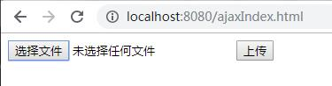

[](../../index.md#index)

<h1 id="imgUpload">图片上传</h1>

<h3>一、SpringBoot图片上传</h3>

**1、创建UploadImg.java**

```java
@RestController
@RequestMapping("/uploadImg")
public class UploadImg {

	@PostMapping("/imgUpload")
	public Object imgFile(@RequestParam("file") MultipartFile file) {
		Map<String, Object> map = new HashMap<String, Object>();
		if (file.isEmpty()) {
			System.out.println("文件为空！");
		}
		// 文件名
		String fileName = file.getOriginalFilename();

		// 后缀名
		String suffxName = fileName.substring(fileName.lastIndexOf("."));
		// 上传后的路径
		String filePath = "D://temp-rainy//";

		// 新文件名
		String newFileName = UUID.randomUUID() + suffxName;

		File dest = new File(filePath + newFileName);
		if (!dest.getParentFile().exists()) {
			dest.getParentFile().mkdirs();
		}
		try {
			file.transferTo(dest);
		} catch (IOException e) {
			e.printStackTrace();
		}
		String filename = "temp-rainiy/" + newFileName;
		map.put("OldFileName", fileName);
		map.put("suffxName", suffxName);
		map.put("filePath", filePath);
		map.put("newFileName", newFileName);
		map.put("filename", filename);
		return map;
	}
}
```

**2、用Postman进行校验。**


**3、查看本地是否添加成功。**


<h3>SpringBoot图片上传(ajax单图片上传+预览)</h3>

**代码**

**pom.xml**

```xml
<dependencies>
        <dependency>
            <groupId>org.springframework.boot</groupId>
            <artifactId>spring-boot-starter-web</artifactId>
        </dependency>

        <dependency>
            <groupId>org.projectlombok</groupId>
            <artifactId>lombok</artifactId>
            <optional>true</optional>
        </dependency>
        <dependency>
            <groupId>org.springframework.boot</groupId>
            <artifactId>spring-boot-starter-test</artifactId>
            <scope>test</scope>
        </dependency>

        <dependency>
            <groupId>org.webjars</groupId>
            <artifactId>bootstrap</artifactId>
            <version>4.1.3</version>
        </dependency>

        <dependency>
            <groupId>org.webjars</groupId>
            <artifactId>jquery</artifactId>
            <version>3.3.1</version>
        </dependency>

        <dependency>
            <groupId>com.alibaba</groupId>
            <artifactId>fastjson</artifactId>
            <version>1.1.26</version>
        </dependency>
    </dependencies>
```

**前端**

```html
<!DOCTYPE html>
<html lang="en">
<head>
    <meta charset="UTF-8">
    <title>ajax图片上传</title>
</head>
<body>
<form action="imageUpload" method="post" enctype="multipart/form-data">
    <input type="file" name="fileName" id="filename" accept="image/png, image/jpeg, image/jpg" onchange="checkImage()">
    <input type="button" id="submitBtn" onclick="checkSubmit()" value="上传"/>
</form>
<div id="showImage"></div>
<div id="onLoadImage"></div>
</body>
<script src="/webjars/jquery/3.3.1/jquery.min.js"></script>
<script src="/webjars/bootstrap/4.1.3/js/bootstrap.min.js"></script>
<script type="text/javascript">

    //检查图片
    function checkImage() {
        var fileName=$("#filename").val();
        fileName=fileName.replace("C:\\fakepath\\","");
        var flag=true;
        if(fileName==""){
            flag=false;
            alert("请选择图片");
        }
        else{
            var size = $("#filename")[0].files[0].size;
            if(size/1000>100){
                flag=false;
                alert("图片大小不能超过100KB");
            }
        }
        if(flag){
            onLoadImage();
        }
        else{//清除input type=file的显示内容
            $("#filename").val("");
        }
        return flag;
    }

    //预览图片
    function onLoadImage() {
        var file=$('#filename').get(0).files[0];
        var reader = new FileReader();
        //将文件以Data URL形式读入页面
        reader.readAsDataURL(file);
        reader.function(e){
            //显示文件
            $("#onLoadImage").html('');
        }
    }

    /*上传图片
   详细参考链接：https://www.cnblogs.com/qiumingcheng/p/6854933.html
   1.processData设置为false。因为data值是FormData对象，不需要对数据做处理。
   2.<form>标签添加enctype="multipart/form-data"属性。
   3.cache设置为false，上传文件不需要缓存。
   4.contentType设置为false，不设置contentType值，因为是由<form>表单构造的FormData对象，且已经声明了属性enctype="multipart/form-data"，所以这里设置为false。
   */
    function checkSubmit() {
        var formdata=new FormData();
        formdata.append('fileName',$('#filename').get(0).files[0]);
        $.ajax({
            async: false,
            type: 'POST',
            url: "/imageUpload",
            dataType: 'json',
            data: formdata,
            contentType:false,//ajax上传图片需要添加
            processData:false,//ajax上传图片需要添加
            success: function (data) {
                if(data.hasOwnProperty("relativePath")){
                    $("#showImage").html("");
                }
                else {
                    $("#showImage").html("上传失败");
                }
                alert(data.result_msg);
            },
            error: function (e) {
                alert("error");
            }
        })
    }
</script>
</html>

```

**后台**

```java
@RequestMapping("/imageUpload")
    public Map imageUpload(@RequestParam("fileName") MultipartFile file){
        String result_msg="";//上传结果信息

        Map<String,Object> root=new HashMap<String, Object>();

        if (file.getSize() / 1000 > 100){
            result_msg="图片大小不能超过100KB";
        }
        else{
            //判断上传文件格式
            String fileType = file.getContentType();
            if (fileType.equals("image/jpeg") || fileType.equals("image/png") || fileType.equals("image/jpeg")) {
                // 要上传的目标文件存放的绝对路径
                //用src为保存绝对路径不能改名只能用原名，不用原名会导致ajax上传图片后在前端显示时出现404错误-->原因未知
//                String localPath="F:\\IDEAProject\\imageupload\\src\\main\\resources\\static\\img";
                final String localPath="F:\\IDEAProject\\imageupload\\target\\classes\\static\\img";
                //上传后保存的文件名(需要防止图片重名导致的文件覆盖)
                //获取文件名
                String fileName = file.getOriginalFilename();
                //获取文件后缀名
                String suffixName = fileName.substring(fileName.lastIndexOf("."));
                //重新生成文件名
                fileName = UUID.randomUUID()+suffixName;
                if (FileUtils.upload(file, localPath, fileName)) {
                    //文件存放的相对路径(一般存放在数据库用于img标签的src)
                    String relativePath="img/"+fileName;
                    root.put("relativePath",relativePath);//前端根据是否存在该字段来判断上传是否成功
                    result_msg="图片上传成功";
                }
                else{
                    result_msg="图片上传失败";
                }
            }
            else{
                result_msg="图片格式不正确";
            }
        }

        root.put("result_msg",result_msg);

//        JSON.toJSONString(root,SerializerFeature.DisableCircularReferenceDetect);
        String root_json=JSON.toJSONString(root);
        System.out.println(root_json);
        return root;
    }

```

**图片上传工具类**

```java
public class FileUtils {

    /**
     * @param file     文件
     * @param path     文件存放路径
     * @param fileName 保存的文件名
     * @return
     */
    public static boolean upload(MultipartFile file, String path, String fileName) {

        //确定上传的文件名
        String realPath = path + "\\" + fileName;
        System.out.println("上传文件：" + realPath);

        File dest = new File(realPath);

        //判断文件父目录是否存在
        if (!dest.getParentFile().exists()) {
            dest.getParentFile().mkdir();
        }

        try {
            //保存文件
            file.transferTo(dest);
            return true;
        } catch (IllegalStateException e) {
            // TODO Auto-generated catch block
            e.printStackTrace();
            return false;
        } catch (IOException e) {
            // TODO Auto-generated catch block
            e.printStackTrace();
            return false;
        }

    }

}
```

**效果**

*起始界面*



*选择上传图片+预览*


Ajax上传+前端显示

