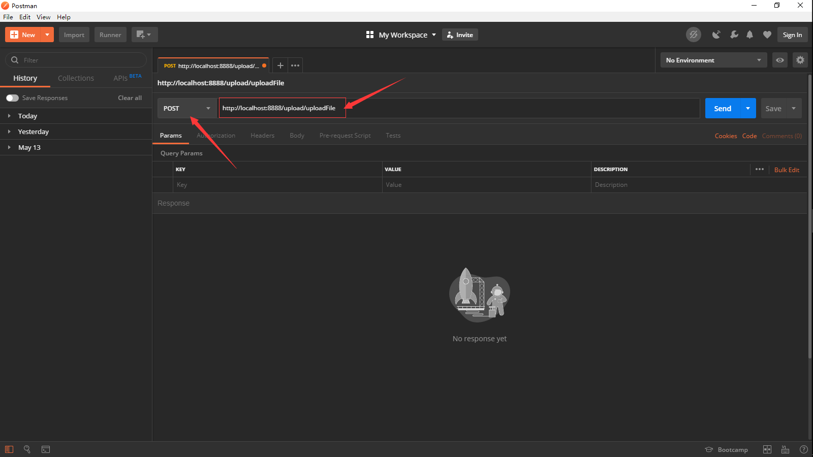

[](../../首页.md#index)

<h1 id="uploadFile">文件上传</h1>

<h3>一、配置文件上传的大小限制</h3>

**application.properties**配置文件添加：

```properties
# 上传文件总的最大值
spring.servlet.multipart.max-request-size=10MB
# 单个文件的最大值
spring.servlet.multipart.max-file-size=10MB
```

- `spring.servlet.multipart.max-file-size`限制单个文件的最大值
- `spring.servlet.multipart.max-request-size`限制上传的多个文件的总大小

<h3>二、单文件上传</h3>

1、创建Controller控制类

```java
package com.desire.controller;

import java.io.File;
import java.io.IOException;
import java.util.List;

import javax.servlet.http.HttpServletRequest;

import org.apache.log4j.Logger;
import org.springframework.web.bind.annotation.RequestMapping;
import org.springframework.web.bind.annotation.RequestParam;
import org.springframework.web.bind.annotation.RestController;
import org.springframework.web.multipart.MultipartFile;
import org.springframework.web.multipart.MultipartHttpServletRequest;

@RestController
@RequestMapping("/upload")
public class Upload {

	private static final Logger LOGGER = Logger.getLogger(Upload.class);

	@RequestMapping("uploadFile")
	public String uploadFile(@RequestParam("file") MultipartFile file) {

		if (file.isEmpty()) {
			return "上传失败，请选择文件";
		}
		String fileName = file.getOriginalFilename();
		System.err.println("文件名称：" + fileName);
		String filePath = "D:/upload/";
		System.err.println("文件保存路径：" + filePath);
		File dest = new File(filePath + fileName);
		try {
			file.transferTo(dest);
			LOGGER.info("上传成功！！！");
			return "上传成功！";
		} catch (IOException e) {
			LOGGER.error(e.toString(), e);
		}
		return "上传失败！！！";
	}
}
```

2、如果要写jsp页面验证的话，选择文件，form的`enctype`为`multipart/form-data`。

我这里直接用Postman进行验证。

1.打开**Postman**

2.填写**url**，选择**POST**提交方式。



3.①选择**Body**

​	②选择**form-data**

​	③添加**KEY**值：**file**

​	④选择**File**

​	⑤添加**VALUE**


4、点击**Send**运行


5、输出返回值。查看上传文件。上传成功！


<h3>三、多文件上传</h3>

在Controller中添加以下方法

```java
@RequestMapping("uploadFiles")
public String uploadFiles(HttpServletRequest request) {
    List<MultipartFile> files = ((MultipartHttpServletRequest) request).getFiles("file");
    System.out.println("选择了文件数：：" + files.size());
    String filePath = "D:/upload/";
	System.err.println("文件保存路径：" + filePath);
	for (int i = 0; i < files.size(); i++) {
		MultipartFile file = files.get(i);
		if (file.isEmpty()) {
			return "上传第" + (i++) + "个文件失败！！！";
		}
		String fileName = file.getOriginalFilename();
		System.err.println("文件名称：" + fileName);
		File dest = new File(filePath + fileName);
		try {
			file.transferTo(dest);
			LOGGER.info("第" + (i + 1) + "个文件上传成功！");
		} catch (IOException e) {
			LOGGER.error(e.toString(), e);
			return "上传第" + (i++) + "个文件失败！！！";
		}
	}
	return "上传成功！！！";
}
```

选择不同的文件。**（注：总大小不要超过你设定的限制值）**


查看上传结果

