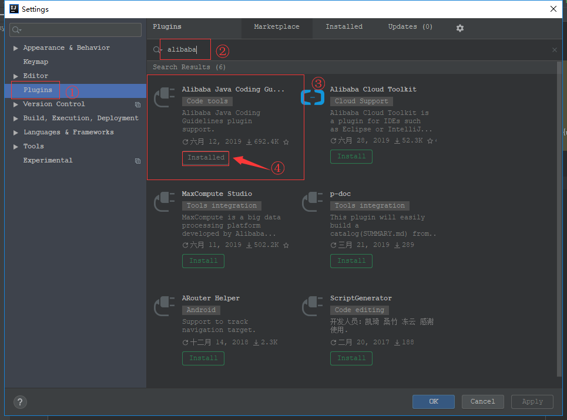
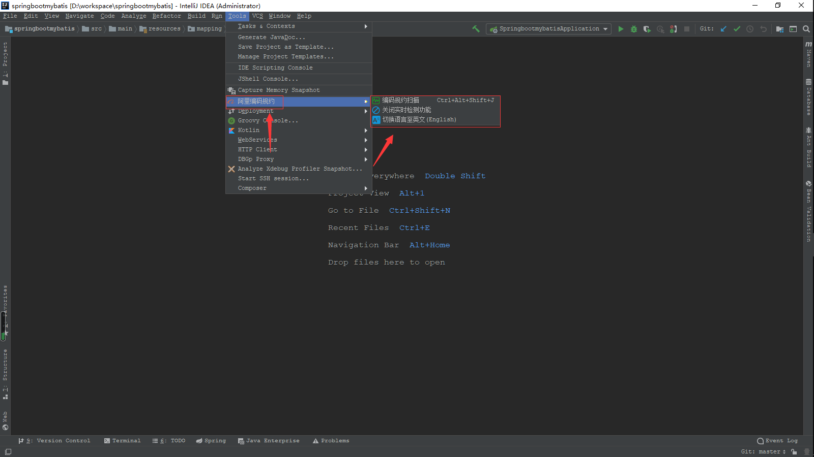
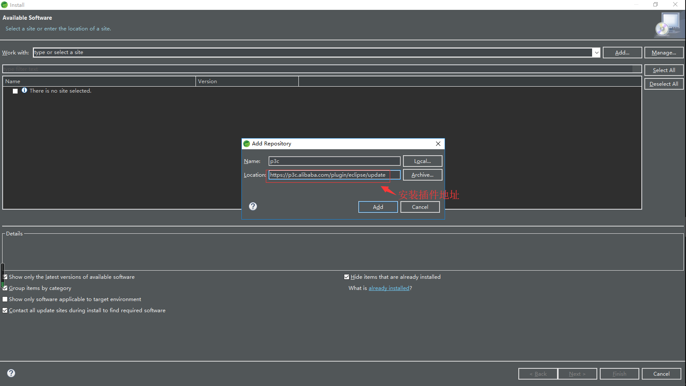
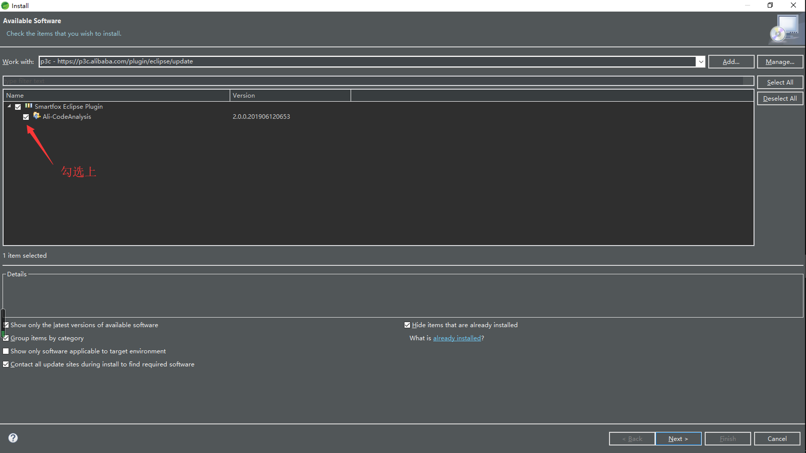
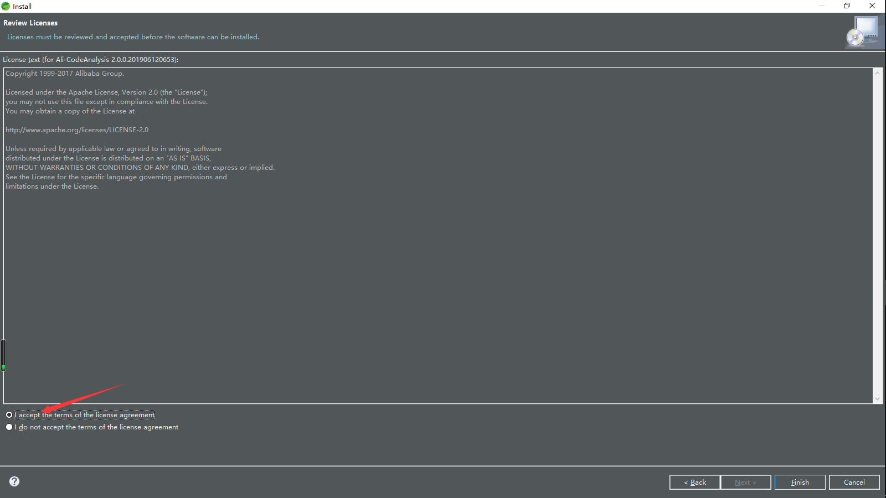
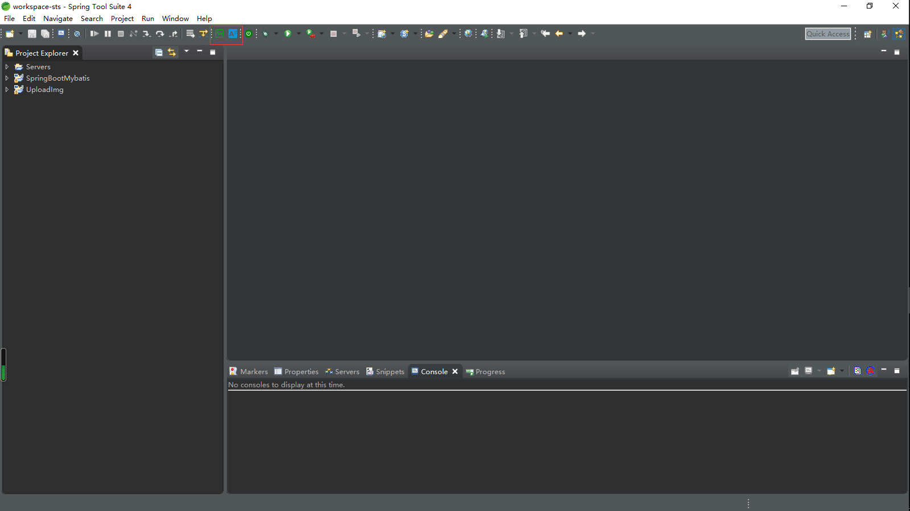
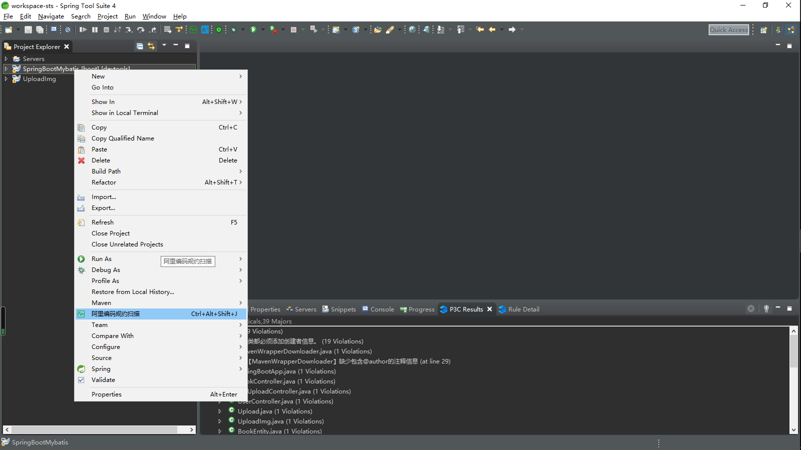
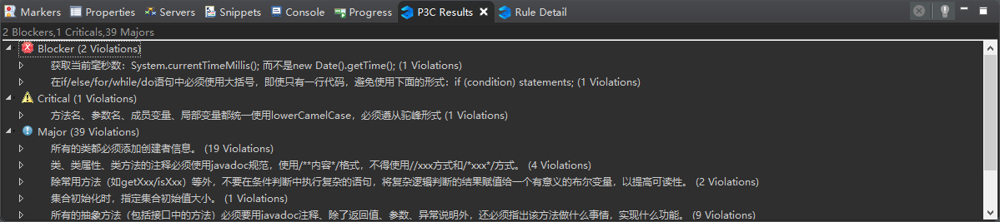

<h1 id="p3c">P3C--alibaba编码规范插件</h1>

**阿里巴巴编码规约插件**

Git Hub : https://github.com/alibaba/p3c

<h3>IDEA安装插件</h3>

1、进入Settings设置中。

2、根据上图步骤进行操作安装，安装完，重新启动IDEA,出现下图情况说明安装成功，可以使用了。

<h3>Eclipse安装插件</h3>

1、插件安装

通过Help >> Install New Software插件安装菜单，在安装插件的地址栏中输入：https://p3c.alibaba.com/plugin/eclipse/update

2、选择安装软件

确定后，直接勾选下面的Smartfox Eclipse Plugnin，然后一直下一步安装（中间需要点“I Accept”）

点击下一步

安装过程有点缓慢。

3、安装完成后需重启eclipse，重启完成后，我们可以看到eclipse任务栏中多了两个小图标

4、代码分析

当我们安装完成后，右键菜单中会出现“阿里编码规约扫描”，我们在指定要分析的类、包或者工程上右键

然后点击“阿里编码规约扫描”，即可分析出代码规范情况

