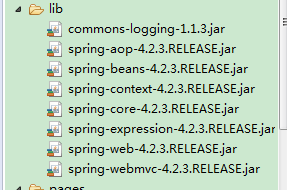
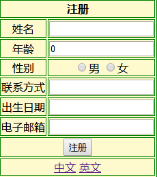
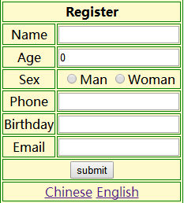

[](../../index.md#index)

<h1 id="gjh">SpringMVC国际化</h1>

### **1.导jar包**

导入几个SpringMVC必需的几个jar包，项目结构图和所需jar包如下：



### **2.配置web.xml**

```xml
<web-app>
	<display-name>Archetype Created Web Application</display-name>
	<!-- POST中文乱码解决方案 -->
	<filter>
		<filter-name>CharacterEncodingFilter</filter-name>
		<filter-class>org.springframework.web.filter.CharacterEncodingFilter</filter-class>
		<init-param>
			<param-name>encoding</param-name>
			<param-value>utf-8</param-value>
		</init-param>
		<!-- 强制使用编码 -->
		<init-param>
			<param-name>forceEncoding</param-name>
			<param-value>true</param-value>
		</init-param>
	</filter>
	<filter-mapping>
		<filter-name>CharacterEncodingFilter</filter-name>
		<url-pattern>/*</url-pattern>
	</filter-mapping>
	<!-- 配置前端配置器 -->
	<servlet>
		<servlet-name>springmvc</servlet-name>
		<servlet-class>org.springframework.web.servlet.DispatcherServlet</servlet-class>
		<!-- DispatcherServlet加载配置文件 -->
		<init-param>
			<param-name>ContextConfigLocation</param-name>
			<param-value>classpath:springmvc.xml</param-value>
		</init-param>
		<load-on-startup>1</load-on-startup>
		<!-- 当启动容器时初始化DispatcherServlet -->
	</servlet>
	<servlet-mapping>
		<servlet-name>springmvc</servlet-name>
		<url-pattern>/</url-pattern>
	</servlet-mapping>
	
</web-app>
```

### **3.** **配置springmvc.xml**

```xml
<!-- 实现国际化 -->
	<!-- 存储区域设置信息 -->
	<bean id="localeResolver"
		class="org.springframework.web.servlet.i18n.SessionLocaleResolver" />
	<!-- 国际化资源文件 -->
	<bean id="messageSource"
		class="org.springframework.context.support.ReloadableResourceBundleMessageSource">
		<property name="basename" value="classpath:i18nMsg" />
	</bean>
	<!-- 过滤器 -->
	<mvc:interceptors>
		<bean id="localeChangeInterceptor"
			class="org.springframework.web.servlet.i18n.LocaleChangeInterceptor">
			<property name="paramName" value="lang" />
		</bean>
	</mvc:interceptors>
```

### **4.** **两个国际化资源文件**

#### **(1)** **i18nMsg_en_US.properties**

```properties
stu.title=Register
stu.name=Name
stu.age=Age
stu.sex=Sex
stu.sex1=Man
stu.sex2=Woman
stu.phone=Phone
stu.birthday=Birthday
stu.email=Email
stu.submit=submit
Chinese=Chinese
English=English
```

#### **(2)** **i18nMsg_zh_CN.properties**

```properties
stu.title=\u6CE8\u518C
stu.name=\u59D3\u540D
stu.age=\u5E74\u9F84
stu.sex=\u6027\u522B
stu.sex1=\u7537
stu.sex2=\u5973
stu.phone=\u8054\u7CFB\u65B9\u5F0F
stu.birthday=\u51FA\u751F\u65E5\u671F
stu.email=\u7535\u5B50\u90AE\u7BB1
stu.submit=\u6CE8\u518C
Chinese=\u4E2D\u6587
English=\u82F1\u6587
```

### **5.后台处理请求的I18nController.java**

```java
@Controller
@RequestMapping("/common")
public class I18nController {

	@RequestMapping(value="/register",method= {RequestMethod.GET})
	public String getPage(@ModelAttribute(value="stu") Student student) {
		return "registerI18n";
	}
	@RequestMapping(value="/register",method= {RequestMethod.POST})
	public ModelAndView results(@ModelAttribute(value="stu") Student student) {
		ModelAndView mv = new ModelAndView();
		mv.setViewName("registerSuccess");
		return mv;
	}
}
```

### **6.编写页面**

#### **(1)** **:registerI18n.jsp**

```jsp
<%@ taglib prefix="form" uri="http://www.springframework.org/tags/form" %>
<%@ taglib prefix="spring" uri="http://www.springframework.org/tags" %>	
<form:form method="post" modelAttribute="stu">
		<table>
			<tr>
				<th colspan="2"><spring:message code="stu.title"/> </th>
			</tr>
			<tr>
				<td><label><spring:message code="stu.name"/></label></td>
				<td>
					<form:input path="sName"/>
				</td>
			</tr>
			<tr>
				<td><label><spring:message code="stu.age"/></label></td>
				<td>
					<form:input path="sAge"/>
				</td>
			</tr>
			<tr>
				<td><label><spring:message code="stu.sex"/></label></td>
				<td>
					<form:radiobutton path="sSex" value="男"/><spring:message code="stu.sex1"/>
					<form:radiobutton path="sSex" value="女"/><spring:message code="stu.sex2"/>
				</td>
			</tr>
			<tr>
				<td><label><spring:message code="stu.phone"/></label></td>
				<td>
					<form:input path="sPhone"/>
				</td>
			</tr>
			<tr>
				<td><label><spring:message code="stu.birthday"/></label></td>
				<td>
					<form:input path="sBirthday"/>
				</td>
			</tr>
			<tr>
				<td><label><spring:message code="stu.email"/></label></td>
				<td>
					<form:input path="sEmail"/>
				</td>
			</tr>
			<tr>
				<td colspan="2">
					<input type="submit" value="<spring:message code='stu.submit'/>">
				</td>
			</tr>
			<tr>
				<td colspan="2">
					<a href="?lang=zh_CN"><spring:message code='Chinese'/></a>
					<a href="?lang=en_US"><spring:message code='English'/></a>
				</td>
			</tr>
		</table>
	</form:form>
```

#### **(2)** **:registerSuccess.jsp**

```jsp
<table>
			<tr>
				<td><label>姓名</label></td>
				<td>
					${stu.sName }
				</td>
			</tr>
			<tr>
				<td><label>年龄</label></td>
				<td>
					${stu.sAge }
				</td>
			</tr>
			<tr>
				<td><label>性别</label></td>
				<td>
					${stu.sSex }
				</td>
			</tr>
			<tr>
				<td><label>联系方式</label></td>
				<td>
					${stu.sPhone }
				</td>
			</tr>
			<tr>
				<td><label>出生日期</label></td>
				<td>
					${stu.sBirthday}
				</td>
			</tr>
			<tr>
				<td><label>Email</label></td>
				<td>
					${stu.sEmail}
				</td>
			</tr>
		</table>
```

### **7.运行**

<http://localhost:8888/SpringMVC2/common/register>

<http://localhost:8888/SpringMVC2/common/register?lang=zh_CN>



<http://localhost:8888/SpringMVC2/common/register?lang=en_US>



