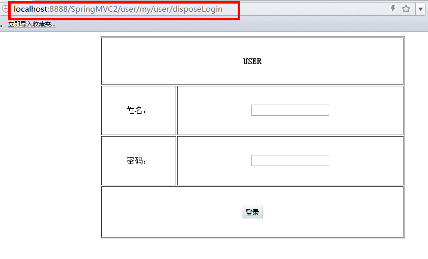
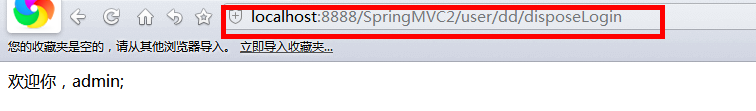

[](../../index.md#index)

<h1 id="zdyljq">SpringMVC自定义拦截器</h1>

 SpringMVC的拦截器HandlerInterceptorAdapter对应提供了三个preHandle，postHandle，afterCompletion方法。preHandle在业务处理器处理请求之前被调用，
    postHandle在业务处理器处理请求执行完成后,生成视图之前执行，afterCompletion在DispatcherServlet完全处理完请求后被调用,可用于清理资源等 。所以要想实现自己的权限管理逻辑，需要继承HandlerInterceptorAdapter并重写其三个方法。

**1.首先在springmvc.xml中加入自己定义的拦截器我的实现逻辑CommonInterceptor，**

```xml
<!--配置拦截器, 多个拦截器,顺序执行 -->  
<mvc:interceptors>    
    <mvc:interceptor>    
       <!--匹配的是url路径，如果不配置或/**,将拦截所有的Controller-->   
        <mvc:mapping path="/user/my/**" />  
        <bean class="com.desire.interceptor.MyLoginInterceptor"></bean>    
    </mvc:interceptor>  
    <!-- 当设置多个拦截器时，先按顺序调用preHandle方法，然后逆序调用每个拦截器的postHandle和afterCompletion方法 -->  
</mvc:interceptors>  
```

2.写一个自定义拦截器**MyLoginInterceptor.java**

我的拦截逻辑是“在未登录前，任何访问url都跳转到login页面；登录成功后跳转至先前的url”，具体代码如下：

```java
/**
 * 自定义拦截器
 * @author Administrator
 *
 */
public class MyLoginInterceptor extends HandlerInterceptorAdapter {

	/**
	 * 在业务处理器处理请求之前被调用  
     * 如果返回false  
     *     从当前的拦截器往回执行所有拦截器的afterCompletion(),再退出拦截器链 
     * 如果返回true  
     *    执行下一个拦截器,直到所有的拦截器都执行完毕  
     *    再执行被拦截的Controller  
     *    然后进入拦截器链,  
     *    从最后一个拦截器往回执行所有的postHandle()  
     *    接着再从最后一个拦截器往回执行所有的afterCompletion()  
	 */
	@Override
	public boolean preHandle(HttpServletRequest request, HttpServletResponse response, Object handler)
			throws Exception {
		// TODO Auto-generated method stub
		String name = (String) request.getSession().getAttribute("USER");
		System.out.println("==============执行顺序: 1、preHandle================");
		System.out.println("name="+name);
		if (name==null) {
			System.out.println("+++++++name+++++++++"+name);
			request.getRequestDispatcher("/WEB-INF/pages/login.jsp").forward(request, response);
			return false;
		}else {
			return true;
		}
		
	}
	/**
	 * 在业务处理器处理请求执行完成后,生成视图之前执行的动作
	 * 可在modelAndView中加入数据，比如当前时间 
	 */
	@Override
	public void postHandle(HttpServletRequest request, HttpServletResponse response, Object handler,
			ModelAndView modelAndView) throws Exception {
		// TODO Auto-generated method stub
		System.out.println("==============执行顺序: 2、postHandle================");
		
	}

	@Override
	public void afterCompletion(HttpServletRequest request, HttpServletResponse response, Object handler, Exception ex)
			throws Exception {
		// TODO Auto-generated method stub
		System.out.println("==============执行顺序: 3、afterCompletion================");
	}

}
```

**3.** **LoginController.java**

```java
@Controller
@RequestMapping("/user")
public class LoginController {
	@RequestMapping(value="/my/login",method= {RequestMethod.GET})
	private String getPage() {
		return "login";
	}
	@RequestMapping(value="/dd/disposeLogin",method= {RequestMethod.POST})
	private String login(@RequestParam(value="userName")String name,
			@RequestParam(value="password")String psw,
			HttpServletRequest request) {
		System.out.println("name="+name+"password="+psw);
		if (name!=null&&psw!=null) {
			request.getSession().setAttribute("USER", name);
			return "index";
		}else {
			return "login";
		}
		
	}
}
```

**4.** **login.jsp**

```jsp
<form method="post" action="/SpringMVC2/user/dd/disposeLogin">
		<table border="1">
			<tr>
				<th colspan="2">
					USER
				</th>
			</tr>
			<tr>
				<td>姓名：</td>
				<td>
					<input type="text" name="userName">
				</td>
			</tr>
			<tr>
				<td>密码：</td>
				<td>
					<input type="password" name="password">
				</td>
			</tr>
			<tr>
				<td colspan="2">
					<input type="submit" value="登录">
				</td>
			</tr>
		</table>
		
	</form>
```

**5.** **运行**

直接访问http://localhost:8888/SpringMVC2/user/my/user/disposeLogin会被拦截



登录成功后会跳转成功页面

