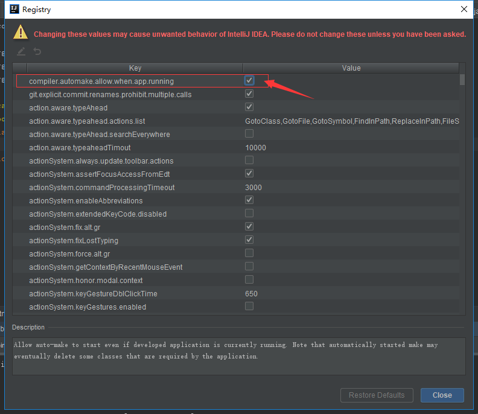

[](../../首页.md#index)

<h1 id="rebushu">SpringBoot 热部署</h1>

开发中，每次对类的修改，都需要重启服务，很浪费时间，影响效率

。所以就需要用到热部署，节省时间提高效率。

### 1、在Maven的pom.xml文件中添加依赖

```xml
<!--Spring Boot提供了一个名为spring-boot-devtools的模块来使应用支持热部署，提高开发者的开发效率，无需手动重启Spring Boot应用-->
<dependency>
   <groupId>org.springframework.boot</groupId>
   <artifactId>spring-boot-devtools</artifactId>
   <!-- optional=true,依赖不会往下传递，如果有项目依赖本项目，并且想要使用devtools，需要重新引入 -->
   <optional>true</optional>
</dependency>
```

###  2、继续在Maven的pom.xml文件中添加插件的配置

```xml
<build>
	<plugins>
        <plugin>
            <groupId>org.springframework.boot</groupId>
            <artifactId>spring-boot-maven-plugin</artifactId>
            <!--自动启动-->
            <configuration>
                <!--fork:如果没有该项配置,整个devtools不会起作用-->
                <fork>true</fork>
            </configuration>
        </plugin>
        <!--自定义配置spring Boot使用的JDK版本-->
        <plugin>
            <artifactId>maven-compiler-plugin</artifactId>
            <configuration>
                <source>1.8</source>
                <target>1.8</target>
            </configuration>
        </plugin>
    </plugins>
</build>
```

###  3、配置文件application.yml中添加

```yml
debug: true
spring:
  devtools:
    remote:
      restart:
        enabled: true #设置开启热部署
  freemarker:
    cache: false #页面不加载缓存，修改及时生效
```

如果是Eclipse，配置到这里，只要重启服务，热部署就会生效了。

但是IDEA的话，热部署还不会生效，因为devTools只会在类路径上的文件发生更改时才会自动重启，而IDEA默认不会自动编译。

1）File -> Settings -> Compliler，勾选Build Project automatically


2）按快捷键Ctrl+Shift+Alt+/，选择1.Registry


3）勾选compiler.automake.allow.when.app.running即可

