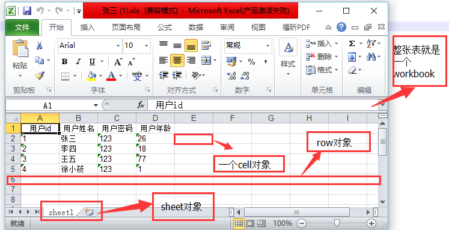
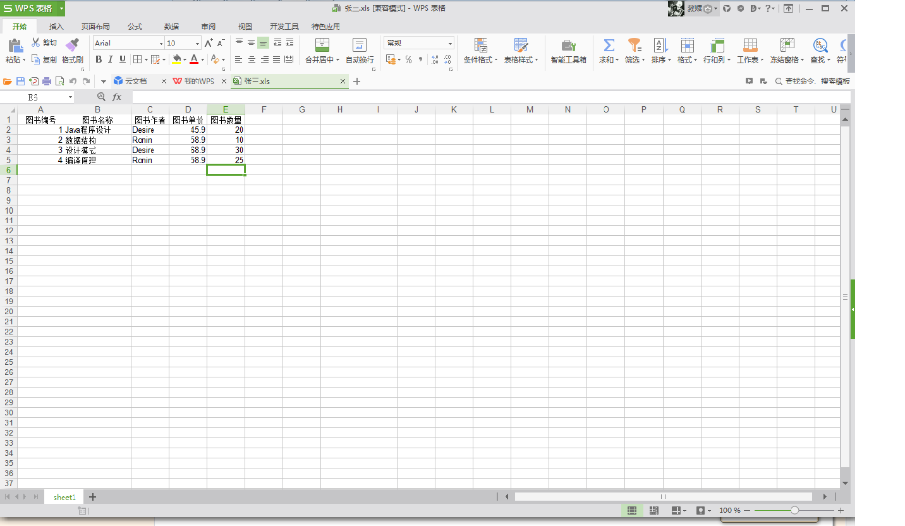

[](../../index.md#index)

<h1 id="excel">SpringMVC--生成Excel文件并导出</h1>

在开发过程中，需要将数据库中的数据以excel表格的方式导出。

 首先说明。我这里用的是Apache的POI项目，它是目前比较成熟的HSSF接口，用来处理Excel对象。其实POI不仅仅只能处理excel，它还可以处理word、PowerPoint、Visio、甚至Outlook。

一、首先介绍利用POI如何生成excel。

首先在生成Excel前，我们需要理解一下Excel文件的组织形式。在POI中，是这样理解的：一个Excel文件对应一个workbook，一个workerbook是有若干个sheet组成的。一个sheet有多个row，一个row一般存在多个cell。

​     对于上面的四个名词我们可以在下图理解：



对于生成Excel，POI提供了如下几个基本对象：

​     HSSFWorkbook          excel 的文档对象

​     HSSFSheet               excel 的表单

​     HSSFRow                 excel 的行

​     HSSFCell                 excel 的格子单元

 从上面的图片和Excel的组织结构，我们就可以明白创建Excel的步骤。

​     1、生成文档对象HSSHWorkbook。

​     2、通过HSSFWorkbook生成表单HSSFSheet。

​     3、通过HSSFSheet生成行HSSFRow

​     4、通过HSSFRow生成单元格HSSFCell。

二、下面展示代码

**第一步：导入****jar包**

```xml
<dependency>
       <groupId>org.apache.poi</groupId>
       <artifactId>poi-ooxml</artifactId>
       <version>3.9</version>
</dependency> 
```

**第二步****：****创建Model对象**

```java
@Component("book")
public class Book {

	private int bookId;
	private String bookName;
	private String bookAuthor;
	private float bookPrice;
	private int bookNum;
Get/set方法......
}
```

**第三步：下载界面 exportexcel.jsp**

```jsp
<script type="text/javascript">
function download(){
     var url="../jsp/download_excel?id=10&name=张三";
     window.open(url);
}
</script>
<body>
<form action="">
	<input type="button" value="报表导出" onclick="download()"/>
</form>
</body>
```

**第四步：定义一个接口IExcleImpl.java**

```java
public interface IExcleImpl {
	void export(String[] titles, ServletOutputStream out, BookService service) throws Exception;
}
```

**第五步：接口实现类ExcleImplService.java**

```java
@Service("excleImplService")
public class ExcleImplService implements IExcleImpl{

@Override
public void export(String[] titles, ServletOutputStream out, BookService service) throws Exception {
		try {
			// 第一步，创建一个workbook，对应一个Excel文件
			HSSFWorkbook workbook = new HSSFWorkbook();
			// 第二步，在weorkbook中添加一个sheet，对应Excel文件中的sheet
			HSSFSheet sheet = workbook.createSheet("sheet1");
			// 第三步，在sheet中添加表头第0行，注意老版本POI对Excel的行数列数有限制short
			HSSFRow row = sheet.createRow(0);
			// 第四步，创建单元格，并设置值表头，设置表头居中
			HSSFCellStyle hssfCellStyle = workbook.createCellStyle();
			// 居中样式
			hssfCellStyle.setAlignment(HorizontalAlignment.CENTER);
			HSSFCell hssfCell = null;
			for (int i = 0; i < titles.length; i++) {
				hssfCell = row.createCell(i);// 列索引从0开始
				hssfCell.setCellValue(titles[i]);// 列名1
				hssfCell.setCellStyle(hssfCellStyle);// 列居中显示
			}
			// 第五步，从数据库中获取数据数据
			List<Book> lists = service.queryBooks();
			for (int i = 0; i < lists.size(); i++) {
				row = sheet.createRow(i + 1);
				Book book = lists.get(i);
				// 第六步，创建单元格，并设置值
				// 图书id
				int id = 0;
				if (book.getBookId() > 0) {
					id = book.getBookId();
				}
				row.createCell(0).setCellValue(id);
				// 图书名
				String name = "";
				if (book.getBookName() != null) {
					name = book.getBookName();
				}
				row.createCell(1).setCellValue(name);
				// 作者名
				String author = "";
				if (book.getBookAuthor() != null) {
					author = book.getBookAuthor();
				}
				row.createCell(2).setCellValue(author);
				// 图书单价
				float price = 0;
				if (book.getBookPrice() > 0) {
					price = book.getBookPrice();
				}
				row.createCell(3).setCellValue(price);
				// 图书数量
				int num = 0;
				if (book.getBookNum() > 0) {
					num = book.getBookNum();
				}
				row.createCell(4).setCellValue(num);
			}
			// 第七步，将文件输出到客户端浏览器
			try {
				workbook.write(out);
				out.flush();
				out.close();
			} catch (Exception e) {
				e.printStackTrace();
			}
		} catch (Exception e) {
			e.printStackTrace();
			throw new Exception("导出信息失败！");
		}
	}
}
```

**第六步：ExcleController.java**

```java
@Controller
public class ExcleController {
	private BookService bookService;
	private ExcleImplService service;
	public BookService getBookService() {
		return bookService;
	}
	@Resource(name="bookService")
	public void setBookService(BookService bookService) {
		this.bookService = bookService;
	}
	public ExcleImplService getService() {
		return service;
	}
	@Resource(name="excleImplService")
	public void setService(ExcleImplService service) {
		this.service = service;
	}
	@RequestMapping(value="/jsp/download_excel")
	@ResponseBody
	public String down(HttpServletResponse response,
			@RequestParam("id")String id,
			@RequestParam("name")String name) throws UnsupportedEncodingException {
		response.setContentType("application/binary;charset=UTF-8");
		try {
			ServletOutputStream out = response.getOutputStream();
			//设置文件头：最后一个参数是设置下载文件名
			response.setHeader("Content-Disposition", "attachment;fileName="+URLEncoder.encode(name+".xls","UTF-8" ));
			String[] titles = {"图书编号","图书名称","图书作者","图书单价","图书数量"};
			service.export(titles, out, bookService);
			return "success";
		} catch (Exception e) {
			e.printStackTrace();
			return "导出信息失败";
		}
	}
}
```

**第七步：最终效果，当我点击报表导出按钮**



