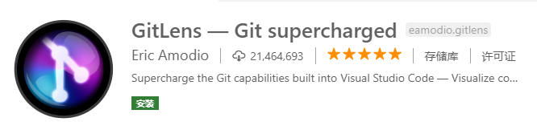

[](../index.md#index)

<h1 id="vsCode">VSCode插件安装</h1>

对编写前端代码比较有帮助的vscode插件

中文插件：

Chinese（Simplified）Language Pack for Visual Studio Code


<h3>1、Vetur</h3>

**vue**多功能集成插件，包括：语法高亮，只能提示，**emmet**，错误提示，代码格式化，自动补全，**debugger**。**vscode**官方钦定**Vue**插件，**Vue**开发者必备。


<h3>2、Auto Close Tag</h3>

自动闭合**HTML**/**XML**标签


<h3>3、Auto Rename Tag</h3>

自动完成另一侧标签的同步修改


<h3>Beautify</h3>

格式化代码，值得注意的是，beautify插件支持自定义格式化代码规则，例如：

```java
{
	"indent_size": 4,
	"indent_char": " ",
	"css": {
		"indent_size": 2
	}
}
```


<h3>Bracket Pair Colorizer</h3>

给括号加上不同的颜色，便于区分不同的区块，使用者可以定义不同括号类型和不同颜色


<h3>ESLint</h3>

　　js语法纠错，可以自定义配置，不过配置较为复杂，建议使用网上一些广泛使用的**eslint**配置。


<h3>GitLens</h3>

　　方便查看git日志，git重度使用者必备



<h3>HTML CSS Support</h3>

　　智能提示CSS类名以及id 


<h3>HTML Snippets</h3>

　　智能提示HTML标签，以及标签含义


<h3>JavaScript(ES6) code snippets</h3>

　　ES6语法智能提示，以及快速输入，不仅仅支持.js，还支持.ts，.jsx，.tsx，.html，.vue，省去了配置其支持各种包含js代码文件的时间


<h3>jQuery Code Snippets</h3>

　　jQuery代码智能提示


<h3>Markdown Preview Enhanced</h3>

　　实时预览markdown，markdown使用者必备


<h3>markdownlint</h3>

　　markdown语法纠错


<h3>Material Icon Theme</h3>

　　个人认为最好的vscode图标主题，支持更换不同色系的图标，值得点出的是，该插件更新极其频繁，基本和vscode更新频率保持一致


<h3>open in browser</h3>

　　vscode不像IDE一样能够直接在浏览器中打开html，而该插件支持快捷键与鼠标右键快速在浏览器中打开html文件，支持自定义打开指定的浏览器，包括：Firefox，Chrome，Opera，IE以及Safari


<h3>Path Intellisense</h3>

　　自动提示文件路径，支持各种快速引入文件


<h3>React/Redux/react-router Snippets</h3>

　　React/Redux/react-router语法智能提示


<h3>Angular Files</h3>

　　集成了angular-cli的功能


<h3>Angular 8 Snippets</h3>

　　angular智能语法提示

