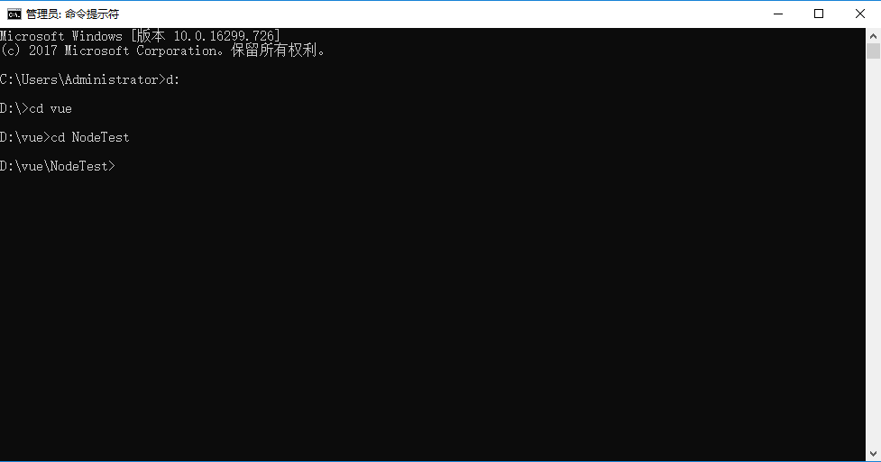
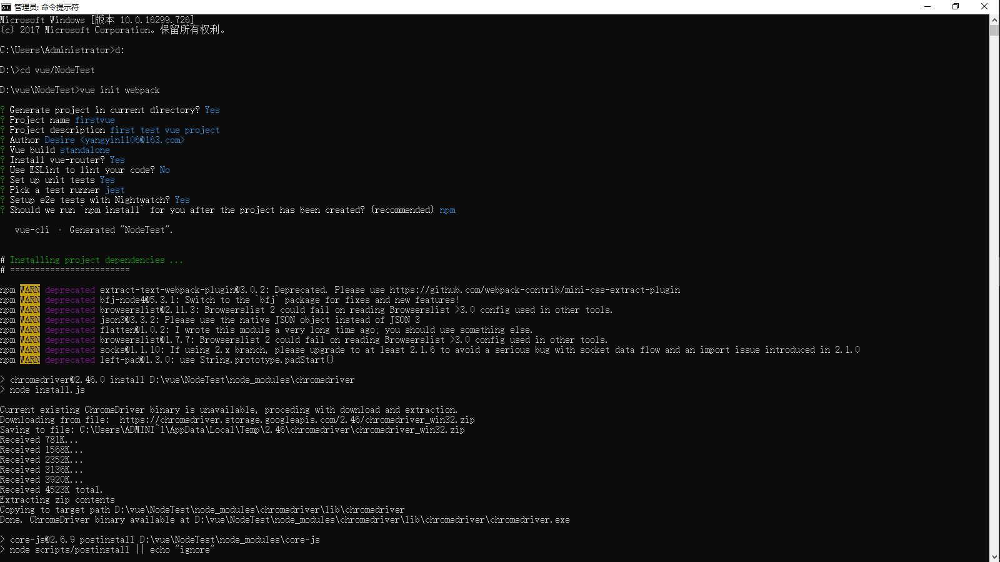
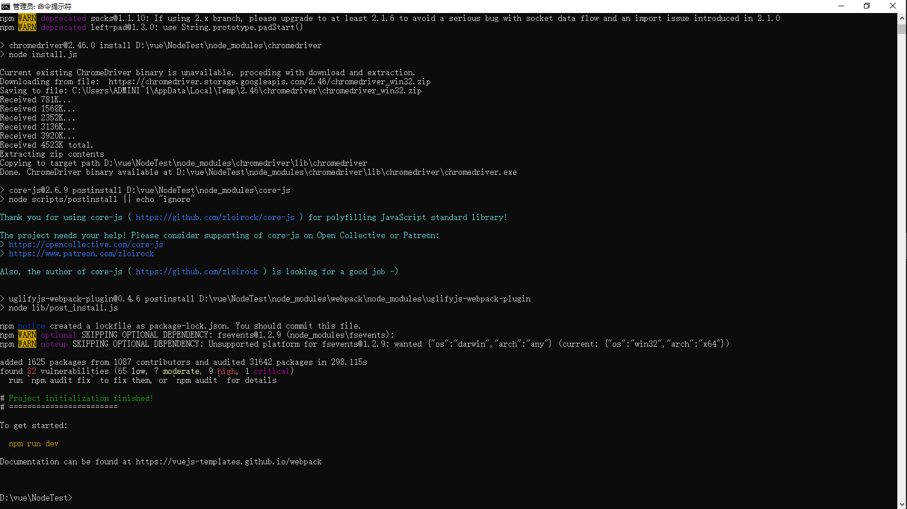
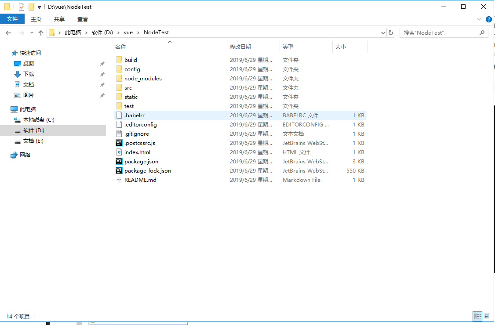
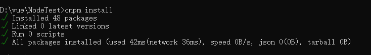
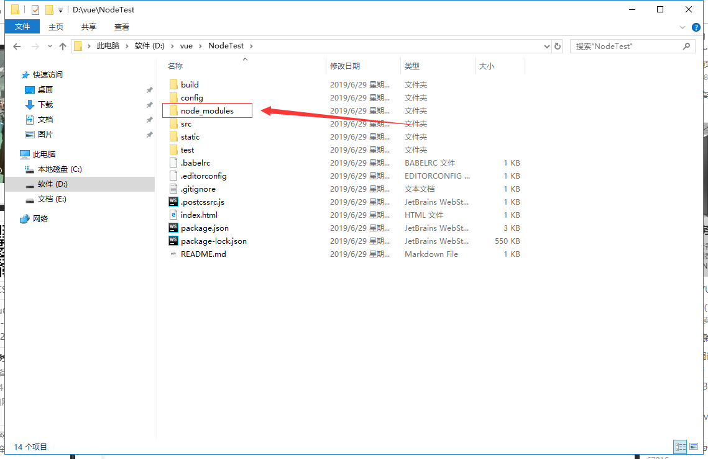
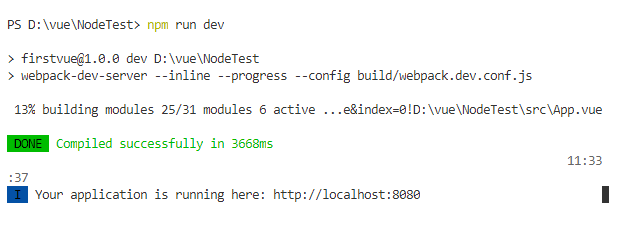
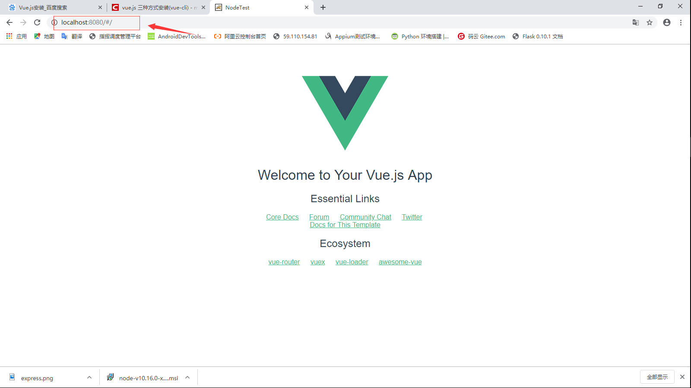

<h2 id="vuecli">使用Vue-cli构建项目</h2>

首先我们要选择存放项目的位置，然后再用命令行cd到项目的目录中，在这里，我选择在d盘下创建新的文件夹vue,又在vue文件夹下常见新的目录（NodeTest 目录），用cd 将目录切到该目录下，如下图：

2、在NodeTest 目录下，在命令行中运行命令 vue init webpack（初始化一个完整版的项目） 。

解释一下这个命令，这个命令的意思是初始化一个项目

其中webpack是构建工具，也就是整个项目是基于webpack的。如下图：

若我们在编辑器中已经手动创建了这个项目存放的文件夹cd到项目中：vue init webpack;初始化一下即可,同时还会加载webpack所依赖的包：

Project name :项目名称 ，如果不需要更改直接回车就可以了。注意：这里不能使用大写，所以我把名称改成了vueclitest
Project description:项目描述，默认为A Vue.js project,直接回车，不用编写。
Author：作者，如果你有配置git的作者，他会读取。
Install  vue-router? 是否安装vue的路由插件，我们这里需要安装，所以选择Y
Use ESLint to lint your code? 是否用ESLint来限制你的代码错误和风格。我们这里不需要输入n（建议），如果你是大型团队开发，最好是进行配置。
setup unit tests with  Karma + Mocha? 是否需要安装单元测试工具Karma+Mocha，我们这里不需要，所以输入n。
Setup e2e tests with Nightwatch?是否安装e2e来进行用户行为模拟测试，我们这里不需要，所以输入n

 运行初始化命令的时候会让用户输入几个基本的配置选项，如项目名称、项目描述、作者信息，对于有些不明白或者不想填的信息可以一直按回车去填写就好了，等待一会，就会显示创建项目创建成功，如下图:

接下来，我们去NoteTest目录下去看是否已创建文件：

介绍一下目录及其作用：

     build：最终发布的代码的存放位置。
    
     config：配置路径、端口号等一些信息，我们刚开始学习的时候选择默认配置。
    
     node_modules：npm 加载的项目所需要的各种依赖模块。
    
     src：这里是我们开发的主要目录（源码），基本上要做的事情都在这个目录里面，里面包含了几个目录及文件：
    
             assets:放置一些图片，如logo等
    
             components:目录里放的是一个个的组件文件
    
             router/index.js：配置路由的地方
    
             App.vue：项目入口组件（跟组件），我们也可以将组件写这里，而不使用components目录。主要作用就是将我们自己定义的组件通过它与页面建立联系进行渲染，这里面的<router-view/>必不可少。
    
             main.js ：项目的核心文件（整个项目的入口js）引入依赖包、默认页面样式等（项目运行后会在index.html中形成一个app.js文件）。
    
     static：静态资源目录，如图片、字体等。
    
     test：初始测试目录，可删除
    
      .XXXX文件：配置文件。
    
     index.html：html单页面的入口页面，可以添加一些meta信息或者同统计代码啥的或页面的重置样式等。
    
     package.json：项目配置信息文件/所依赖的开发包的版本信息及所依赖的插件信息。
    
     README.md：项目的说明文件。
    
     webpack.config.js：webpack的配置文件，把.vue的文件打包成浏览器能读懂的文件。
    
     .babelrc:是检测es6语法的文件的配置
    
     .getignore:忽略文件的配置（比如模拟本地数据mock不让他在get提交/打包上线的时候忽略不使用可在这里配置）
    
     .postcssrc.js:前缀的配置 
    
     .eslintrc.js:配置eslint语法规则（在这里面的rules属性中配置让哪个语法规则失效）
    
     .eslintignore:忽略eslint对项目某些文件的语法规则的检查

    这就是整个项目的目录结构，其中，我们主要在src目录中做修改（模块化开发）。这个项目现在还只是一个结构框架，整个项目需要的依赖资源都还没有安装。
    cd  项目名；进入项目中
    
    安装项目所需要的依赖包/插件（在package.json可查看）：执行 cnpm install   (npm可能会有警告，这里可以用cnpm代替npm了，运行别人的代码需要先安装依赖)如果创建项目的时候没有报错，这一步可以省略。如果报错了  cd到项目里面运行  cnpm install   /  npm install

若拿到别人的项目或从gethub上下载的项目第一步就是要在项目中cnpm install;下载项目所依赖的插件，然后npm run dev 运行项目

安装完成之后，我们到自己的项目中去看，会多一个node_modules文件夹，这里面就是我们所需要的依赖包资源。

安装完依赖包资源后，我们就可以运行整个项目了。

**运行项目**

​    在项目目录中，运行命令 npm run dev （npm run start），会用热加载的方式运行我们的应用，热加载可以让我们在修改完代码后不用手动刷新浏览器就能实时看到修改后的效果。

运行效果

