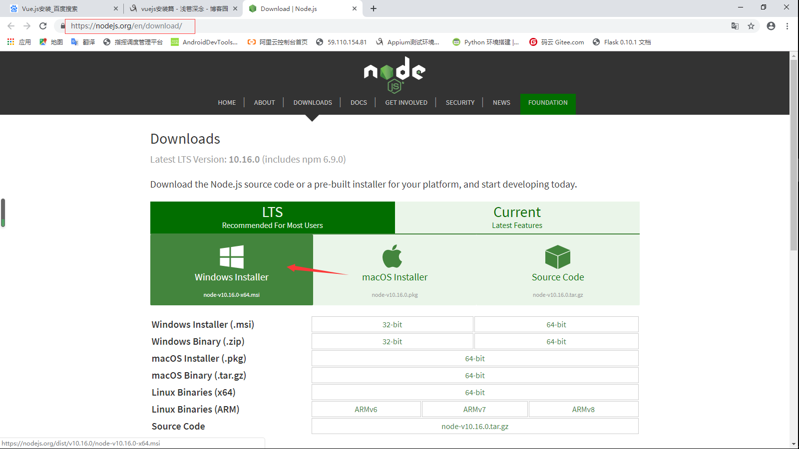
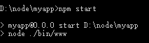

[](../index.md#index)

<h2>Vue.js安装</h2>

1、安装node.js，自带npm环境。

下载地址：[https://nodejs.org/en/download/](https://nodejs.org/en/download/)



检查是否安装成功：

```
C:\Windows\system32>node --version
v12.2.0
```

2、安装淘宝镜像。

因国内访问国外链接速度过慢，建议将 npm 的注册表源[设置为国内的镜像](http://riny.net/2014/cnpm/)，可以大幅提升安装速度。（注意=后面不能有空格，否则会报错。）

```
npm install -g cnpm -registry=https://registry.npm.taobao.org
```

3.安装express（选择安装，基于 [Node.js](https://nodejs.org/en/) 平台，快速、开放、极简的 Web 开发框架）。

```
cnpm install -g express
npm install -g express-generator
express myapp，然后就会发现cmd当前目录下面多了一个文件夹myapp

npm start启动
```



4.安装webpack 。

```
cnpm install -g webpack
```

5.安装vue。

```
cnpm install vue
```

6.安装 vue-cli脚手架构建工具（必须在全局中进行安装，npm install * -g就是全局安装，npm install *，不带-g就是本地安装，）

```
cnpm install -g vue-cli
```

7、至此，已经完成了环境的搭建，可以开始项目初始化。

​			 是否安装成功：vue -V

​           webpack的版本查询：webpack -v

